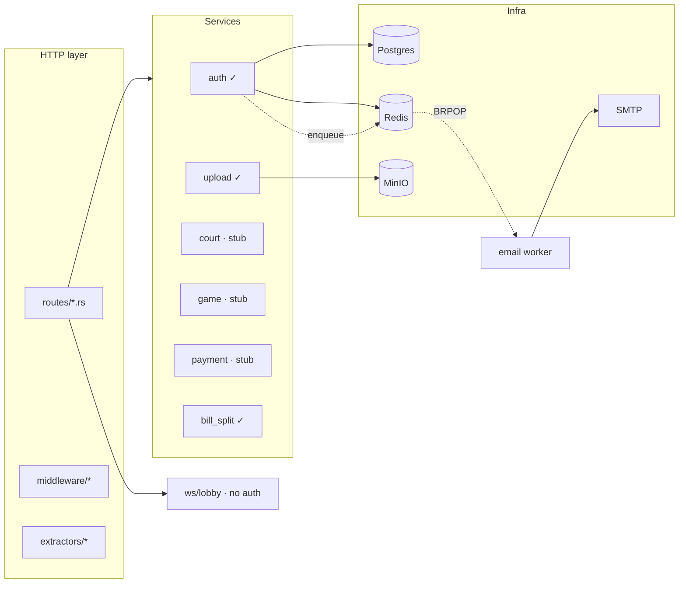
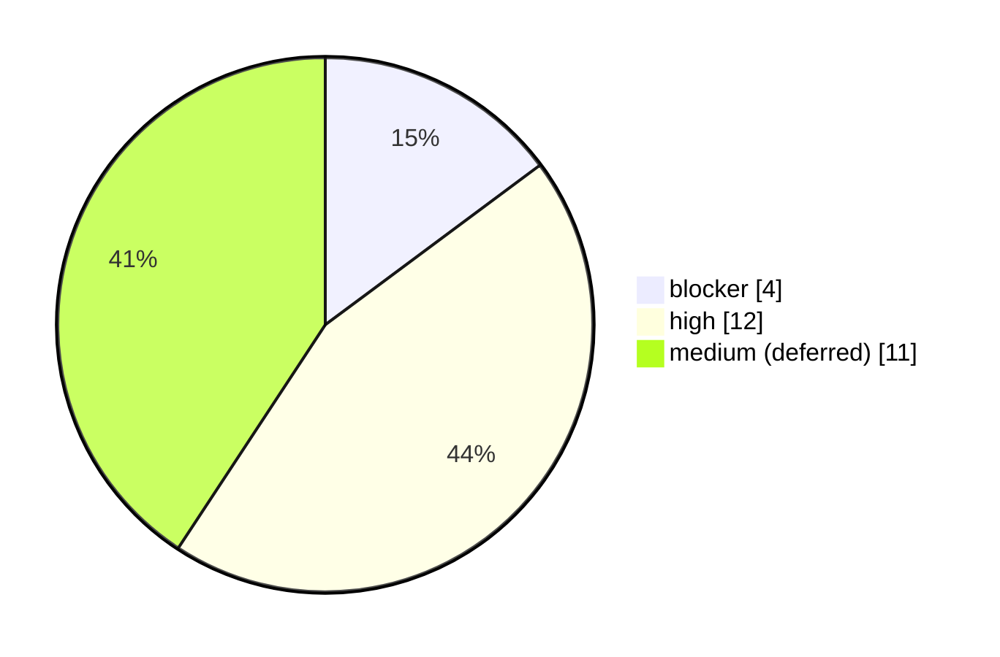
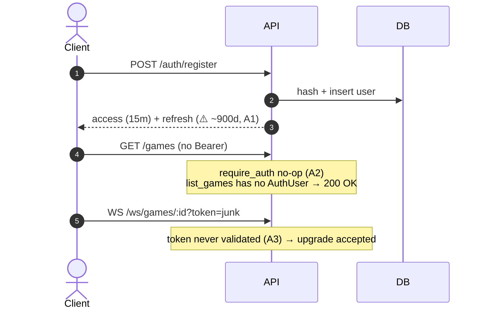
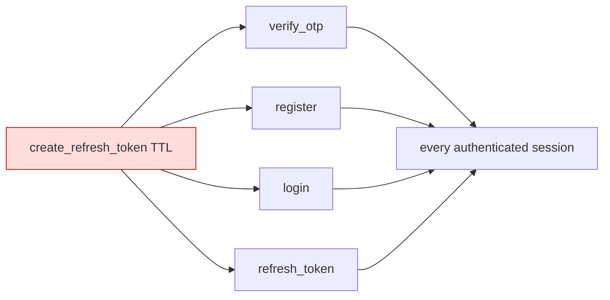

# PR Review — Server foundation: auth, upload, email, MinIO

`HEAD` (`3d33616` + `edcab1c`) → `main` · 2026-04-30 · Dinh Xuan Phu

## Scope

Phase-1 backend skeleton: HTTP layer, service layer, infra. Auth + upload + bill_split are wired end-to-end; court / game / payment are routed but the service methods are stubs. Email runs through a Redis-backed worker. WebSocket lobby is mounted but unauthenticated.

## Severity

## Must-fix

| # | Sev | Where | Issue | Fix |
|---|-----|-------|-------|-----|
| A1 | blocker | [services/auth.rs:89,143,199,229](../../server/src/services/auth.rs#L89) | refresh-token TTL passed as `mins*60` / `days*60` to a `days`-typed param → tokens valid 900–1800d | pass `refresh_ttl_days` directly; add round-trip TTL test |
| A2 | blocker | [middleware/auth.rs:18](../../server/src/middleware/auth.rs#L18), [routes/mod.rs:35](../../server/src/routes/mod.rs#L35) | `require_auth` is `next.run(req)`; `list_games`/`get_game`/ws don't take `AuthUser` → effectively public | implement JWT verify in mw, or delete it and add `AuthUser` to every handler |
| A3 | blocker | [ws/lobby.rs:32](../../server/src/ws/lobby.rs#L32) | WS upgrade accepts any client; `?token=` ignored | decode token, reject 401, also reject non-players |
| A4 | blocker | [server/.env.example:17-18](../../server/.env.example#L17-L18) | real Gmail + app-password committed | rotate password now, scrub history |
| A5 | high | [services/auth.rs:185](../../server/src/services/auth.rs#L185) | `+84` double-prefixed when input already has it → split user records | normalize: strip `+84`/leading `0` then prepend |
| A6 | high | [models/otp.rs:30](../../server/src/models/otp.rs#L30) | `RegisterRequest.password` has no `min` validation | add `#[validate(length(min=8))]` |
| A7 | high | [services/auth.rs:57](../../server/src/services/auth.rs#L57) | attempt counter reset on every `send_otp` → no real rate limit | per-IP/email limiter on `POST /auth/otp` |
| A8 | high | [services/auth.rs:301](../../server/src/services/auth.rs#L301) | password reset doesn't revoke existing tokens | `password_changed_at` claim or refresh allow-list |
| D1 | high | [db/users.rs](../../server/src/db/users.rs) | uses runtime `query_as::<_,_>` despite CLAUDE.md saying compile-time | switch to `query_as!` macros |
| D2 | high | [services/{court,game,payment}.rs](../../server/src/services/) | stubs return `400 BadRequest`; webhooks return `200 OK` without verifying signature | return `501`/`503`; gate webhook routes behind feature flag until impl |
| I1 | high | [Dockerfile:15](../../server/Dockerfile#L15) | `cargo sqlx prepare` needs DB or pre-built `.sqlx/`; build will fail | delete line; commit `.sqlx/` after D1 |
| I2 | high | [.gitignore:8](../../.gitignore#L8) vs [Dockerfile:9](../../server/Dockerfile#L9) | `Cargo.lock` gitignored but COPY'd | remove from gitignore, commit lockfile |
| I3 | high | [docker-compose.yml:51](../../docker-compose.yml#L51) | `init-mc.sh` mounted but never run → bucket missing on first up | one-shot `minio-init` service depending on healthcheck |
| I4 | high | [docker-compose.yml:54](../../docker-compose.yml#L54) | healthcheck depends on `mc` alias only set by init script | use HTTP probe `/minio/health/ready` |
| O1 | high | [jobs/email.rs:73](../../server/src/jobs/email.rs#L73) | `BRPOP` removes msg before send; SMTP error = lost email | `BRPOPLPUSH email:queue email:processing`, LREM after success |
| T1 | high | [Cargo.toml:69](../../server/Cargo.toml#L69) | `axum-test` declared, no integration tests; no JWT TTL test (would catch A1) | smoke test for register→login→me; assert TTL math |

## Follow-ups _(file as issues, don't block this PR)_

- [ ] `VerifyOtpRequest.phone` accepted unvalidated, written to `users.phone` ([models/otp.rs:14](../../server/src/models/otp.rs#L14))
- [ ] no graceful shutdown — SIGTERM drops in-flight + email worker ([main.rs:74](../../server/src/main.rs#L74))
- [ ] `#[allow(dead_code)]` on payment webhook fns that ARE called ([services/payment.rs:39](../../server/src/services/payment.rs#L39))
- [ ] bill-split tests miss invariant `per*count + remainder == total` ([services/bill_split.rs:74](../../server/src/services/bill_split.rs#L74))
- [ ] avatar object key fixed → CDN/browser cache poisoning ([services/upload.rs:23](../../server/src/services/upload.rs#L23))
- [ ] weak hardcoded secrets + prod-flavored compose filename + `restart: unless-stopped`
- [ ] runtime stage WD = `/`; works only because `migrate!` embeds at compile time — add comment
- [ ] both compose files duplicate postgres/redis/minio service defs → drift risk
- [ ] no request-id propagation; errors don't correlate to a request
- [ ] PII (email) in plaintext logs ([services/auth.rs:44](../../server/src/services/auth.rs#L44))
- [ ] no CI workflow

## Auth flow today (A1 + A2 + A3 highlighted)

## Blast radius — A1

## Checklist

- [ ] A1–A4 resolved
- [ ] A5–A8, D1–D2, I1–I4, O1, T1 resolved or explicitly waived
- [ ] follow-ups filed as issues
- [ ] `cargo build --release && cargo clippy -- -D warnings && cargo test`
- [ ] migrations clean on fresh DB · `sqlx prepare` after D1 with `.sqlx/` committed
- [ ] `docker compose up -d` healthy · `curl :8080/health` → 200
- [ ] no secrets in diff · A4 history scrubbed if app-password still live

> Lows and notes from this branch go in PR review comments, not here.
