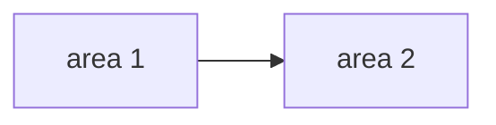
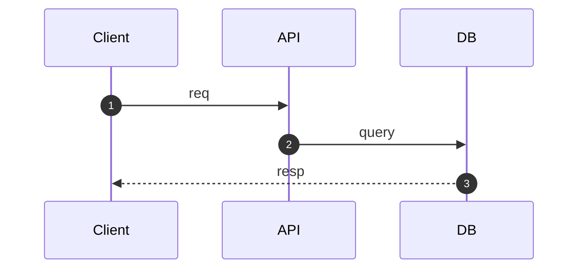
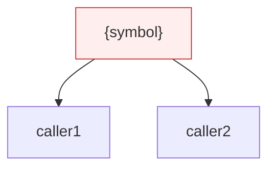

# PR Review — {title}

> One-line title for the PR — what's shipping, not how. Filename: `YYYY-MM-DD-{slug}.md`.

`{branch}` → `main` · YYYY-MM-DD · {author}

> Branch + base + date written + self-reviewer. Lets readers cross-reference with `git log`.

## Scope

What this PR touches and how the pieces connect — orient the reviewer in 5 seconds. One node per area (route group, service, table, infra component); arrows show data/control flow. Annotate nodes that are stubs or unfinished.



## Severity

Counts of must-fix + deferred findings. The pie is the at-a-glance signal: if "blocker" is non-zero, the PR isn't ready.

```mermaid
pie showData
    "blocker" : 0
    "high"    : 0
    "medium (deferred)" : 0
```

## Must-fix

Blockers and highs only — every row gates the merge. One line per column; if you need a paragraph, it's probably a follow-up, not a must-fix.

| # | Sev | Where | Issue | Fix |
|---|-----|-------|-------|-----|
| F1 | blocker | `path:line` | one line | one line |
| F2 | high | `path:line` | | |

## Follow-ups _(mediums — open as issues, don't block)_

Things worth fixing but not now. File each as a tracker issue and link the number; that way the doc stays static and the live status lives in the tracker.

- [ ] {one line} → #{issue}
- [ ] {one line} → #{issue}

## Flow _(only if behavior changed)_

Sequence diagram for any user-visible flow this PR changes (auth, payment, booking). Skip if the PR is internal-only refactor or new endpoint with no cross-service interaction.



## Blast radius _(only for risky symbols)_

Callers/dependents of a high-risk change — answers "if this fix is wrong, what breaks?". Use it for hot symbols (auth, DB pool, error handler) or wide refactors. Skip for isolated fixes.



## Checklist

Final gate before opening the PR. Tick each box manually — don't auto-check.

- [ ] all must-fix rows resolved or waived (note why)
- [ ] follow-ups filed as issues
- [ ] `cargo build && cargo clippy -- -D warnings && cargo test`
- [ ] migrations clean on fresh DB · `sqlx prepare` if SQL changed
- [ ] `docker compose up -d` healthy
- [ ] no secrets / real credentials in diff

> Lows and notes go in PR review comments, not here.
